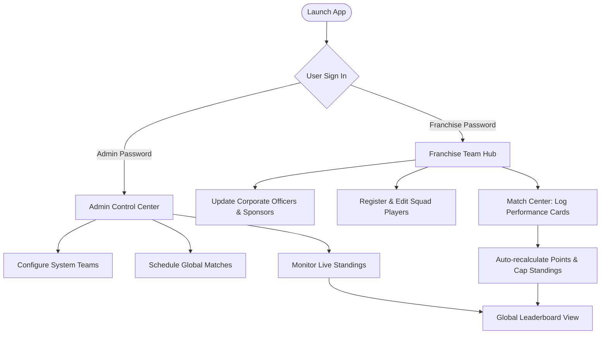
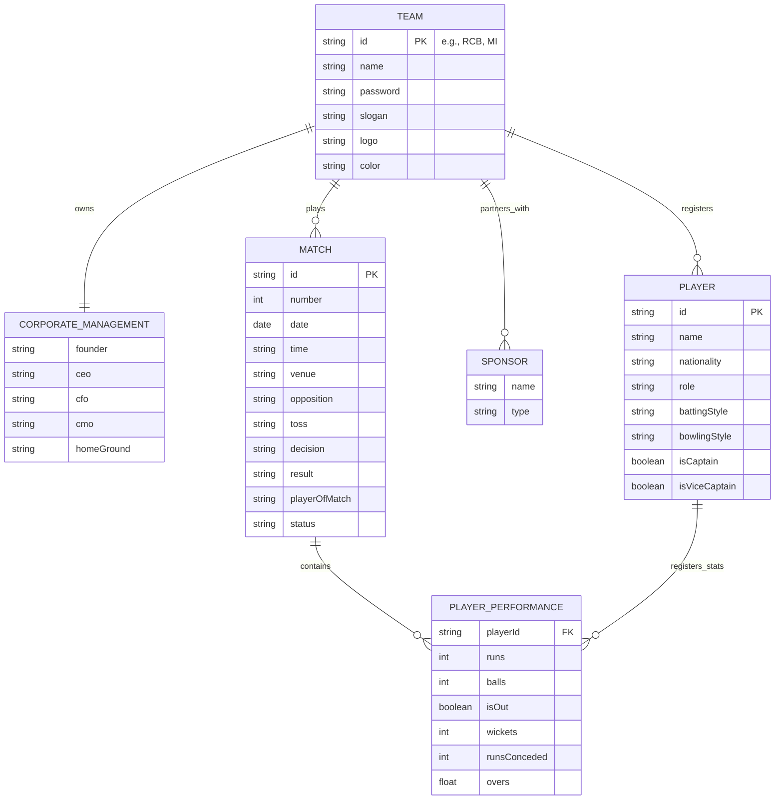

# 🏏 Zstar Premier League (ZPL) — Cricket Tournament Management Portal

Welcome to **ZPL Premier Suite**, a luxury-themed Cricket Tournament Management Portal and Analytics Suite built for tracking and coordinating franchises, team rosters, matches, and real-time statistics for the Zstar Premier League.

---

## 🌟 Key Features

### 📊 Global Portal & Dashboard
* **Real-time Standings Table**: Auto-sorted points table based on match results (Wins, Losses, Points, Played).
* **Cap Holders Tracker**: Real-time evaluation of the **Orange Cap** (leading run-scorer) and **Purple Cap** (leading wicket-taker) across the entire tournament.
* **Insights & Analytics**: In-depth statistical analysis, head-to-head match-up simulator, and performance projection graphs.

### 🏢 Franchise Hub
* **Corporate Profile & Staff Directory**: Manage owners, CEOs, CFOs, and operational staff (Coaching Board, PR/Media, Physios, Operations Support).
* **Official Sponsors & Partners**: Track corporate partnerships and sponsorships for each franchise.

### 👥 Squad Matrix & Roster Management
* Filter players by category: Batsmen, All-rounders, Wicketkeepers, Spin Bowlers, and Fast Bowlers.
* Register new players and track customized individual statistics (Runs, Average, Strike Rate, Wickets, Economy) updated automatically by match results.

### 📅 Match Tracking Center
* Manage scheduled matches and record match results.
* Update playing XIs, player-by-player performance cards, toss decisions, and match notes.

---

## 📈 Architecture & System Flow

### User & Operational Workflow


### Entity-Relationship Diagram (ERD)


---

## 🛠 Tech Stack

* **Frontend Framework**: [React 18](https://react.dev/)
* **Build System**: [Vite](https://vitejs.dev/)
* **Icons**: [Lucide React](https://lucide.dev/)
* **Styling**: Modern, responsive CSS with luxury dark mode elements and glassmorphism.

---

## 🚀 Getting Started

### Prerequisites
Make sure you have [Node.js](https://nodejs.org/) installed.

### Installation

1. Install dependencies:
   ```bash
   npm install
   ```

2. Run the development server:
   ```bash
   npm run dev
   ```

3. Build for production:
   ```bash
   npm run build
   ```

---

## 🔑 Demo Access Credentials

The application supports role-based logins. Use the following credentials to log in:

* **Administrator Access**:
  * **Password**: `admin123`
* **Royal Challengers Bengaluru (RCB) Management**:
  * **Password**: `RCB18`
* **Mumbai Indians (MI) Management**:
  * **Password**: `MI45`
* **Chennai Super Kings (CSK) Management**:
  * **Password**: `CSK7`

---

## 📂 Project Structure

```
├── src/
│   ├── App.jsx        # Main UI application layout, state management, and pages
│   ├── data.js        # Seed teams, initial players, and matches dataset
│   ├── index.css      # Core luxury design system tokens, layout styling
│   └── main.jsx       # React application entry point
├── app.js             # Client-side routing, vanilla styling and rendering logic
├── index.html         # Application page layout entry
├── styles.css         # Global stylesheet for vanilla layouts
├── package.json       # Node package dependencies & scripts
└── vite.config.js     # Vite configuration
```

---

*Developed and maintained by Zstar studio's pvt ltd (Founder: Mr. Zeeshan M)*